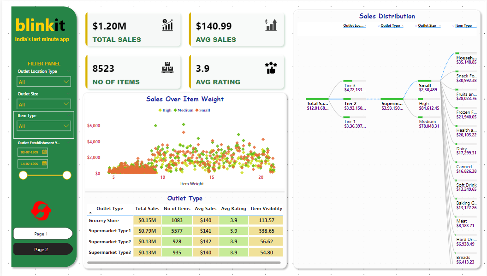

# blinkit Analysis

## ❓ BUSINESS REQUIREMENT
#### To conduct a comprehensive analysis of Blinkit's sales performance, customers satisfaction and inventory distribution to identify key insights and opportunities for optimization using KPIs and visualization in Power BI.

### 🛠 Tools Used
    1. Excel
    2. Power BI

# 📉 Dashboard

### KPIs  Requirements
    1. Total Sales 
    2. Average Sales
    3. Number of items
    4. Average Rating 

### Chat's Requirements
    1. Total Sales by Fat Contents
        objective : Analyze the impact of fat content on the total sales
        Additional KPI Metrics : Assess how other KPIs (Average Sales, Number of Items, Average Rating) vary with fat content.
        Chart Type : Donut Chart
    2. Total Sales by Item type
        objective : Identify the the performance of different items types in terms of fat content.
        additional KPI Metrics :  Assess how other KPIs (Average Sales, Number of Items, Average Rating) vary with fat content.
        Chart Type : Bar Chart
    3. Fat Contents by Outlet for total sales
        Objective : Compare total sales across different outlets segmented by fat content
        Additional KPI Metrics :  Assess how other KPIs (Average Sales, Number of Items, Average Rating) vary with fat content.
        Chart Type : Stacked Column chart
    4. Total Sales by Outlet Establishment
        Objective : Evaluate how the age or type of outlet establishment influences total sales.
        Chat Type : Line Chart
    5. Sales by Outlit Size : 
        Objective : Analyze the correlation between outlet size and total sales.
        Chat Type :  Donut Chat
    6. Sales by Outlet Location
        Objective : Assess the geographic distribution of sales across different locations.
        Chat Type : Funnel Map.
    7. All Metrics by Outlet Type
        Objective : Provide a comprehensive viwe of all key metrics(Average Sales, Number of Items, Average Rating) broken down by different outlet types.
        Chat Type : Matrix Chat
    8. Sales Distribution over  Outlet and Item tyeps
        Objective : Provide a comprehensive viwe of all key total sales broken down by different outlet and item types.
        Chat Type : Decomposition tree

